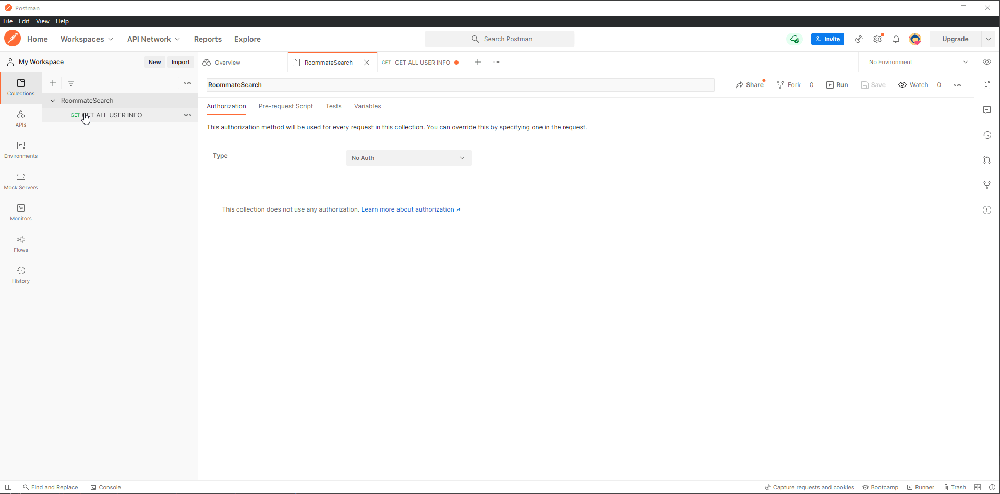

# RoommateSearch

## Group Members:
1. Michael Ivanov
2. Reecha Khanal
3. Saksham Nagar
4. Sukanth Sundaran

## Project Description

Our project aims at helping students or people who have moved to a new town ease their move process by helping them find roommates and getting used to the new town. Our main feature for this project will be finding roommates based on one's location and other criterias. We want to enable potential-roomates with similar interests to be matched to and contact one another. 

## Technology Stack:
Front-end: Angular version 11.0.0
Back-end: Golang 1.17.6

## Sprint One:

Mock Database Schema Information: [[Link Here]](https://github.com/ReechaKhanal/RoommateSearch/wiki/Database)

Backend API Working:

An Image of the Data Returned by the Backend:

Frontend Mock Login Page:

Frontend Home and Profile Page:

The data being pulled in the frontend Home Page is the Mock data present in the database called through a backend API request.

## Development server

Run `go run .` in the `/server` directory for the back-end server. The server will run on `http://localhost:8080` and will be accepting requests.

Run `ng serve` for a dev server. Navigate to `http://localhost:4200/`. The app will automatically reload if you change any of the source files.

## Code scaffolding

Run `ng generate component component-name` to generate a new component. You can also use `ng generate directive|pipe|service|class|guard|interface|enum|module`.

## Build

Run `ng build` to build the project. The build artifacts will be stored in the `server/static` directory. Use the `--prod` flag for a production build.

Run `go run -tags prod` to run the static build of the website.

## Running unit tests

Run `ng test` to execute the unit tests via [Karma](https://karma-runner.github.io).

## Running end-to-end tests

Run `ng e2e` to execute the end-to-end tests via [Protractor](http://www.protractortest.org/).

## Further help

To get more help on the Angular CLI use `ng help` or go check out the [Angular CLI Overview and Command Reference](https://angular.io/cli) page.
.
