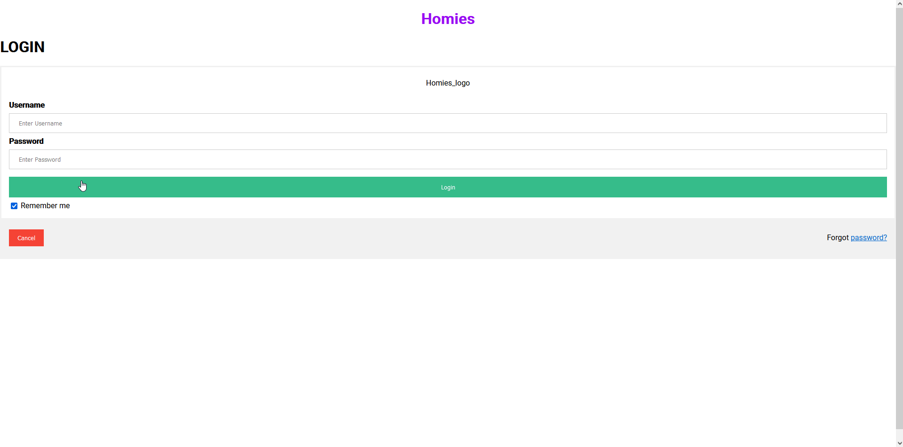

## Sprint One:

Sprint One Board: [[https://github.com/users/ReechaKhanal/projects/10/views/4]](https://github.com/users/ReechaKhanal/projects/10/)

Mock Database Schema Information: [[Link Here]](https://github.com/ReechaKhanal/RoommateSearch/wiki/Database)

## Major Tasks and Accomplishments:

 1. A setup for angular Frontend.

 2. A setup for Goland backend
        [Issue #12](https://github.com/ReechaKhanal/RoommateSearch/issues/12)
        [Issue #16](https://github.com/ReechaKhanal/RoommateSearch/issues/16)

 3. Database Schema Creation and Visualization
        [Issue #1](https://github.com/ReechaKhanal/RoommateSearch/issues/1)
        [Issue #6](https://github.com/ReechaKhanal/RoommateSearch/issues/6)

 4. Setup SQL Database in backend and fill it with Mock data
        [Issue #4](https://github.com/ReechaKhanal/RoommateSearch/issues/4)
        [Issue #6](https://github.com/ReechaKhanal/RoommateSearch/issues/6)

 5. Create a Backend API call system that can serve the frontend
        [Issue #3](https://github.com/ReechaKhanal/RoommateSearch/issues/3)
        [Issue #20](https://github.com/ReechaKhanal/RoommateSearch/issues/20)
 5. Front-end Create a Mock Login Page
        [Issue #1](https://github.com/ReechaKhanal/RoommateSearch/issues/1)

 6. Front-end Create components for profile, and home where potential roommate matches will be displayed
         [Issue #5](https://github.com/ReechaKhanal/RoommateSearch/issues/5)
         [Issue #31](https://github.com/ReechaKhanal/RoommateSearch/issues/31)
         [Issue #45](https://github.com/ReechaKhanal/RoommateSearch/issues/45)

7. Create a Connection between Frontend and Backend through a API Call, parse data returned and display in the Application
        [Issue #3](https://github.com/ReechaKhanal/RoommateSearch/issues/3)
        [Issue #23](https://github.com/ReechaKhanal/RoommateSearch/issues/23)
        [Issue #26](https://github.com/ReechaKhanal/RoommateSearch/issues/26)
        [Issue #33](https://github.com/ReechaKhanal/RoommateSearch/issues/33)

Backend API Working:

An Image of the Data Returned by the Backend:

Frontend Mock Login Page:

Frontend Home and Profile Page:

The data being pulled in the frontend Home Page is the Mock data present in the database called through a backend API request.
