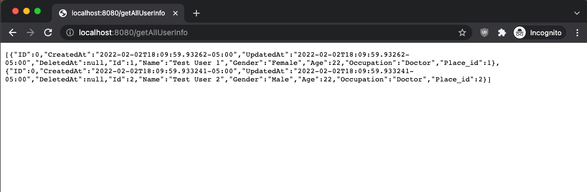

## Sprint One:

Mock Database Schema Information: [[Link Here]](https://github.com/ReechaKhanal/RoommateSearch/wiki/Database)

Backend API Working:

An Image of the Data Returned by the Backend:

Frontend Mock Login Page:

Frontend Home and Profile Page:

The data being pulled in the frontend Home Page is the Mock data present in the database called through a backend API request.
