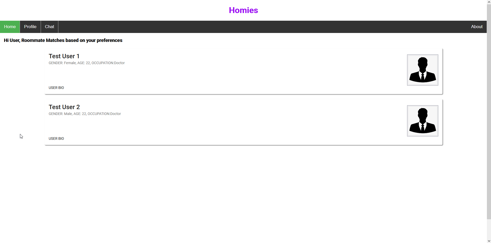

## Sprint One:

Sprint One Board: [[https://github.com/users/ReechaKhanal/projects/10/views/4]](https://github.com/users/ReechaKhanal/projects/10/)

Mock Database Schema Information: [[Link Here]](https://github.com/ReechaKhanal/RoommateSearch/wiki/Database)

- Back-end
  - Created a Database with Mock Data ([#1][i1])
  - Listen for GET request and respond with data from database ([#20][i20])
  - Added a "Dev" mode for the server ([#38][i38])
- Front-end
    - Display user details in cards ([#45][i45])
    - Created routing between pages ([#48][i48])
    - Navbar and user profiles ([#31][i31])
- Other
  - Create a connection between front-end and back-end ([#3][i3])
  - Parse back-end data ([#26][i26])

[i1]: https://github.com/ReechaKhanal/RoommateSearch/issues/1
[i20]: https://github.com/ReechaKhanal/RoommateSearch/issues/20
[i38]: https://github.com/ReechaKhanal/RoommateSearch/pull/38
[i45]: https://github.com/ReechaKhanal/RoommateSearch/issues/45
[i48]: https://github.com/ReechaKhanal/RoommateSearch/issues/48
[i31]: https://github.com/ReechaKhanal/RoommateSearch/issues/31
[i3]: https://github.com/ReechaKhanal/RoommateSearch/issues/3
[i26]: https://github.com/ReechaKhanal/RoommateSearch/issues/26

Backend API Working:

An Image of the Data Returned by the Backend:

Frontend Mock Login Page:

Frontend Home and Profile Page:

The data being pulled in the frontend Home Page is the Mock data present in the database called through a backend API request.
