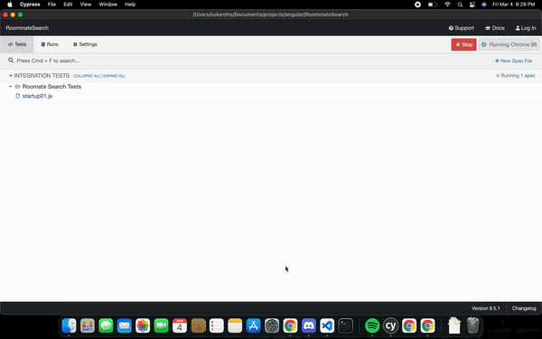
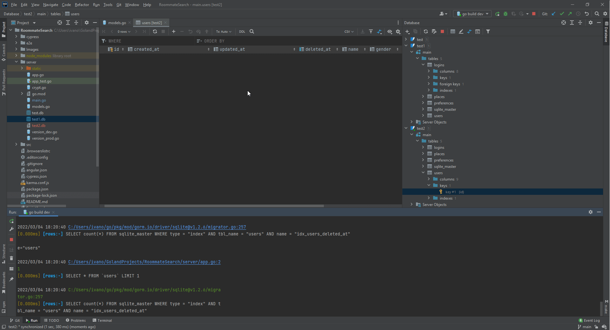

## Sprint Two:

Sprint Two Board: [[Click here Sprint Two Issue Boards]](https://github.com/users/ReechaKhanal/projects/11)
Mock Database Schema Information: [[Link Here]](https://github.com/ReechaKhanal/RoommateSearch/wiki/Database)
Backend API Documentation: [[Chick Here]]

## Major Tasks and Accomplishments:

  1. A functioning Homepage, Edit Profile and Side Navigation bar
        [Issue #63](https://github.com/ReechaKhanal/RoommateSearch/issues/63)
        [Issue #56](https://github.com/ReechaKhanal/RoommateSearch/issues/56)
        [Issue #84](https://github.com/ReechaKhanal/RoommateSearch/issues/84)
  
  2. Database Schema Enhancement and Documentation
        [Issue #39](https://github.com/ReechaKhanal/RoommateSearch/issues/39)
        [Issue #44](https://github.com/ReechaKhanal/RoommateSearch/issues/44)
  
  3. Functioning Login and Signup Page with backend integration
        [Issue #50](https://github.com/ReechaKhanal/RoommateSearch/issues/50)
        [Issue #54](https://github.com/ReechaKhanal/RoommateSearch/issues/54)
        [Issue #67](https://github.com/ReechaKhanal/RoommateSearch/issues/67)
        [Issue #39](https://github.com/ReechaKhanal/RoommateSearch/issues/39)
        [Issue #72](https://github.com/ReechaKhanal/RoommateSearch/issues/72)

  4. Enhancement of footer and adding developer Info
        [Issue #79](https://github.com/ReechaKhanal/RoommateSearch/issues/79)
        
  5. Cypress Testing for Login Page
        [Issue #59](https://github.com/ReechaKhanal/RoommateSearch/issues/59)
        
  6. Connecting Routes and Enabling functionalities on the homepage
        [Issue #61](https://github.com/ReechaKhanal/RoommateSearch/issues/61)
        
  7. Unit testing and Postman for Signup and Login API
        [Issue #92](https://github.com/ReechaKhanal/RoommateSearch/issues/92)
        [Issue #58](https://github.com/ReechaKhanal/RoommateSearch/issues/58)

  
  Cypress Testing for Home Page and Chats Page:
    
  
  Postman for Signup and Login Page:
    

