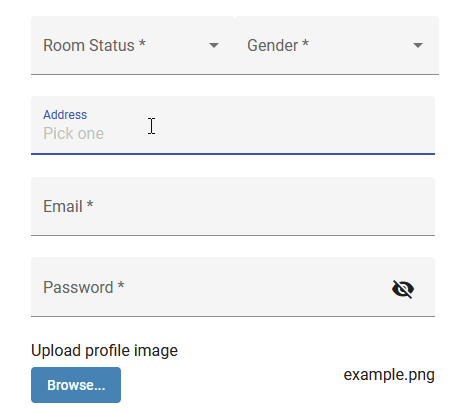
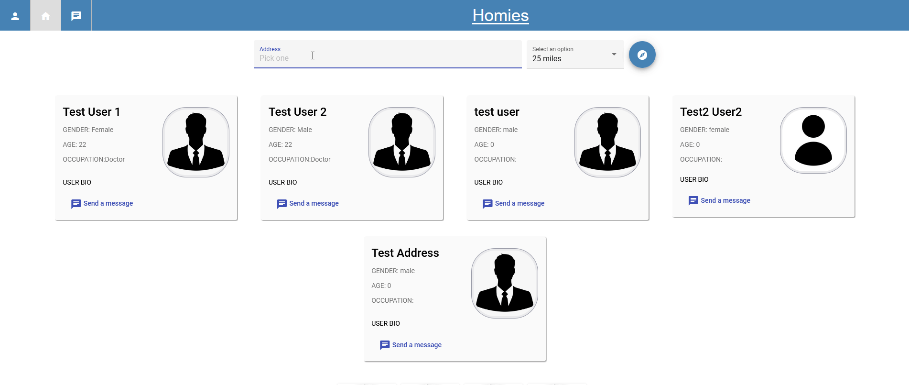
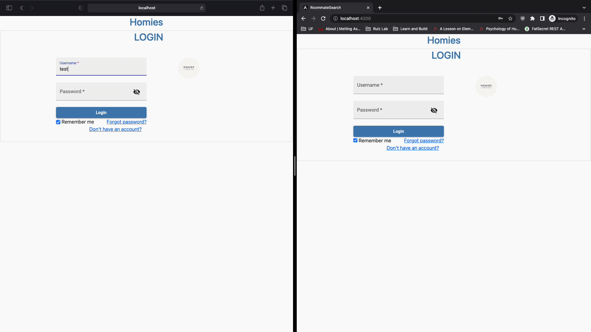
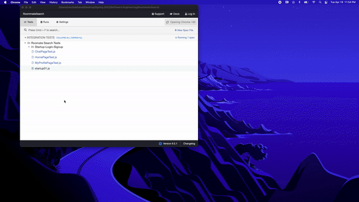
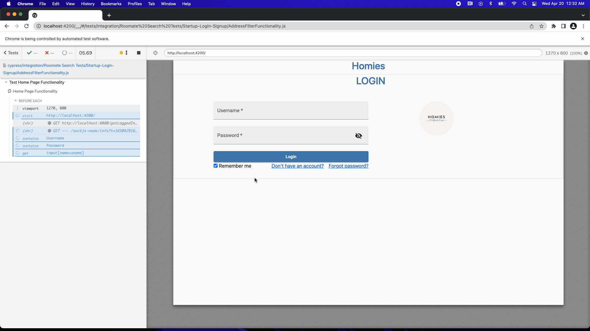

## Sprint Four:

Sprint Four Board:  [[Click here for Sprint Three Issues Board]](https://github.com/users/ReechaKhanal/projects/13/views/1)
Database Schema Information:  [[Link Here]](https://github.com/ReechaKhanal/RoommateSearch/wiki/Database)
Routing and API Information:  [[Link Here]]

## Major Tasks and Accomplishments: 

1. Completed a Personalized Chat/Message Functionality
  [Issue #172](https://github.com/ReechaKhanal/RoommateSearch/issues/172)
  [Issue #173](https://github.com/ReechaKhanal/RoommateSearch/issues/173)
  [Issue #176](https://github.com/ReechaKhanal/RoommateSearch/issues/176)
  [Issue #178](https://github.com/ReechaKhanal/RoommateSearch/issues/178)
  [Issue #179](https://github.com/ReechaKhanal/RoommateSearch/issues/179)
  [Issue #182](https://github.com/ReechaKhanal/RoommateSearch/issues/182)
  [Issue #190](https://github.com/ReechaKhanal/RoommateSearch/issues/190)
  [Issue #193](https://github.com/ReechaKhanal/RoommateSearch/issues/193)
      
2. Database Schema Enhancement and Documentation:
  [Issue #155](https://github.com/ReechaKhanal/RoommateSearch/issues/155)
  [Issue #156](https://github.com/ReechaKhanal/RoommateSearch/issues/156)
  [Issue #167](https://github.com/ReechaKhanal/RoommateSearch/issues/167)
  [Issue #168](https://github.com/ReechaKhanal/RoommateSearch/issues/168)
    
3. Added a Complete and Functioning Address and Filtering based on Location (Other users nearest to you):
[Issue #113](https://github.com/ReechaKhanal/RoommateSearch/issues/113)
[Issue #117](https://github.com/ReechaKhanal/RoommateSearch/issues/117)
[Issue #188](https://github.com/ReechaKhanal/RoommateSearch/issues/188)
 
4. Created a Make File for the Application:
[Issue #14](https://github.com/ReechaKhanal/RoommateSearch/issues/14)

## [Backend] Post-man API Testing

## Front-end Functionality

#### Address Autofill Functionality

#### Filter by Users Nearest to the Location You Enter

### Personalized Chat Between Two Logged in Users.

## [Front-end] Cypress Testing:

#### Cypress Testing for Application Startup and Login

#### Cypress Testing for Location Functionality

